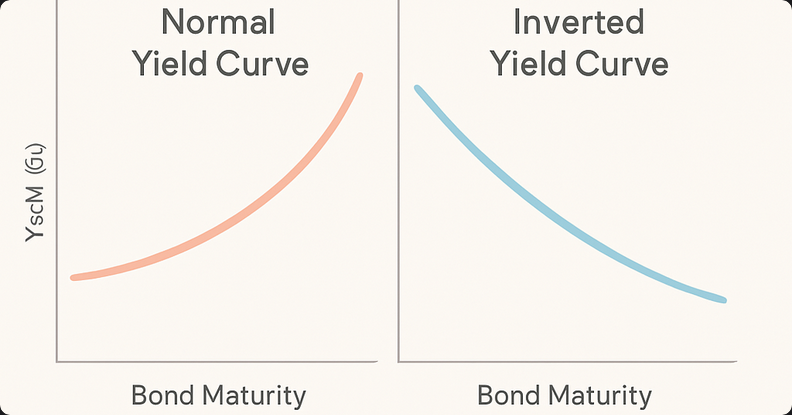

> 📉 Una curva de rendimiento invertida suele ser vista como una señal de advertencia en los mercados financieros. Pero, ¿qué es exactamente y por qué genera tanta atención?

---

## 📈 ¿Qué es la curva de rendimiento?

La **curva de rendimiento** es un gráfico que muestra las tasas de interés (rendimientos) de los bonos del gobierno de un país, ordenados según su plazo de vencimiento (por ejemplo: 3 meses, 2 años, 10 años).

Normalmente, los bonos a mayor plazo ofrecen un rendimiento más alto que los de corto plazo, reflejando el mayor riesgo y la incertidumbre del tiempo.

---

## 🔄 ¿Qué significa que esté "invertida"?

Una **curva de rendimiento invertida** ocurre cuando los bonos a corto plazo ofrecen un rendimiento mayor que los bonos a largo plazo. Es decir, la curva se inclina hacia abajo en vez de hacia arriba.

Esto suele interpretarse como que los inversores esperan un deterioro de la economía en el futuro, por lo que buscan refugio en bonos a largo plazo, subiendo su precio y bajando su rendimiento.

---

## 🚨 ¿Por qué es importante?

Históricamente, una curva de rendimiento invertida ha precedido a varias recesiones económicas importantes. No es una garantía de recesión, pero sí un indicador que los analistas y bancos centrales observan de cerca.

---

## 📝 Ejemplo visual

Imagina dos curvas:
- **Curva normal:** Rendimientos suben con el plazo (de izquierda a derecha)
- **Curva invertida:** Rendimientos bajan con el plazo

---

## 🔎 ¿Por qué sucede esto?

- Los inversores temen recesión y buscan seguridad en bonos largos.
- El banco central puede estar subiendo tasas de corto plazo para combatir inflación.
- Expectativas de menor crecimiento o inflación en el futuro.

---

> ⚠️ Una curva de rendimiento invertida no es una profecía, pero sí una señal de alerta sobre las expectativas económicas.
